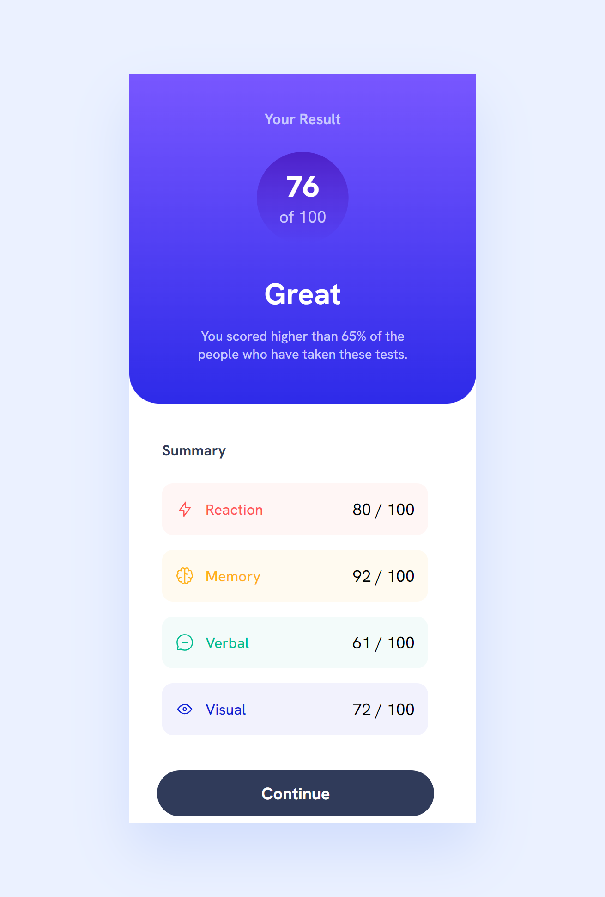
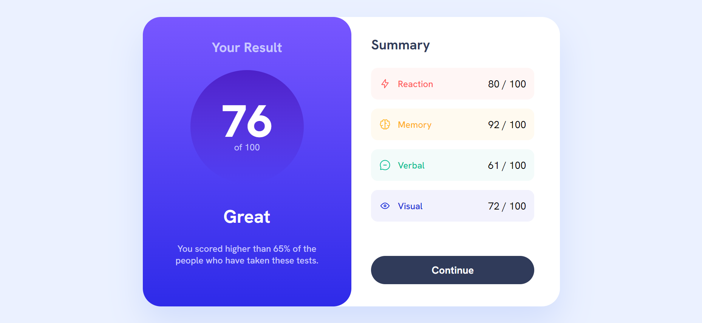

# Frontend Mentor - Results summary component solution

This is a solution to the [Results summary component challenge on Frontend Mentor](https://www.frontendmentor.io/challenges/results-summary-component-CE_K6s0maV). Frontend Mentor challenges help you improve your coding skills by building realistic projects. 

## Table of contents

- [Overview](#overview)
  - [The challenge](#the-challenge)
  - [Screenshot](#screenshot)
  - [Links](#links)
- [My process](#my-process)
  - [Built with](#built-with)
  - [What I learned](#what-i-learned)
  - [Continued development](#continued-development)
  - [Useful resources](#useful-resources)
- [Author](#author)

## Overview

### The challenge

Users should be able to:

- View the optimal layout for the interface depending on their device's screen size
- See hover and focus states for all interactive elements on the page

### Screenshot




### Links

- Solution URL: [https://github.com/jtsenpai/Result-Summary-Component](https://github.com/jtsenpai/Result-Summary-Component)
- Live Site URL: [https://jts-result-summary-component.netlify.app](https://jts-result-summary-component.netlify.app)

## My process

### Built with

- Semantic HTML5 markup
- CSS custom properties
- Flexbox
- CSS Grid
- [React](https://reactjs.org/) - JS library

### What I learned

Recently, I started a React for Beginners course on Scrimba and as a way to practice what I learned, I chose to do this project

I learned a bit on how to use CSS Grid and Flex while working on React. I also put my array map method to use while getting the data from the json file
```js
data.map((item) => ())
```

### Continued development

I plan to continue learning React while working on CSS Frameworks

### Useful resources

- [MDN Array Map](https://developer.mozilla.org/en-US/docs/Web/JavaScript/Reference/Global_Objects/Array/map) - I used this as a point of reference for my code

## Author

- LinkedIn - [Jesutoni Odufeso](https://www.linkedin.com/in/jesutoni-odufeso-25b1b9223)
- Frontend Mentor - [@jtsenpai]https://www.frontendmentor.io/profile/jtsenpai)
- Twitter - [@jtsenpai002](https://twitter.com/jtsenpai002)
